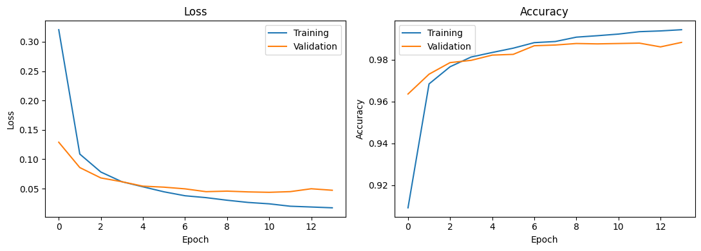
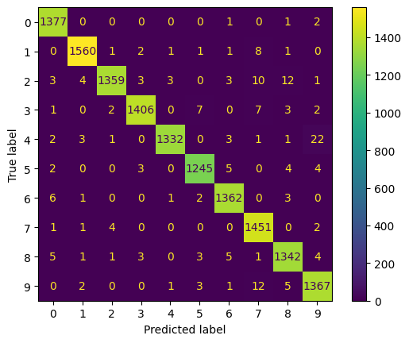
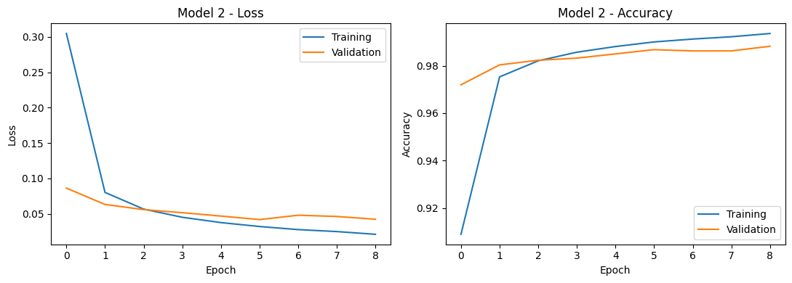
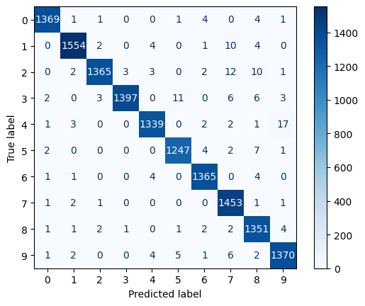

# CNN Handwritten Digit Recognition and Error Analysis

## Project Overview

This project investigates the performance of a convolutional neural network (CNN) for handwritten digit recognition using the MNIST dataset. The main goal is not only to achieve high classification accuracy, but also to examine where the model makes mistakes and whether one controlled change to the network can reduce some of those errors.

The analysis focuses on the confusion matrix to identify the digit pairs that are most frequently misclassified. A second, deeper CNN is then trained under the same conditions in order to compare its overall accuracy and the pattern of classification errors with the original model.

## Dataset and Preprocessing

The project uses the MNIST dataset, which contains 70,000 grayscale images of handwritten digits from 0 to 9. Each image has a resolution of 28 × 28 pixels.

The images are reshaped to include a single grayscale channel, resulting in an input shape of 28 × 28 × 1. Pixel values are normalised to the range [0, 1] by dividing them by 255. The data are then split into training and test sets using an 80/20 stratified split, so the class distribution is preserved across both sets.

During model training, 10% of the training set is additionally used as validation data.

## Method

The baseline model is a convolutional neural network implemented with Keras. It consists of a convolutional layer with 32 filters and a 3 × 3 kernel using ReLU activation, followed by 2 × 2 max pooling and a dropout layer with a rate of 0.3. The extracted features are then flattened and passed through a dense layer with 64 ReLU units, followed by a 10-unit softmax output layer for digit classification.

The model is trained using the Adam optimiser, sparse categorical cross-entropy loss, and accuracy as the evaluation metric. Training is allowed to run for up to 15 epochs with a batch size of 128. Early stopping monitors validation loss with a patience of 3 epochs and restores the best-performing weights.

For the second model, only one controlled architectural change is introduced: an additional convolutional layer with 64 filters and a 3 × 3 kernel, followed by another 2 × 2 max-pooling layer before the flattening stage. All other training settings are kept the same so that the comparison between the two models remains fair.

## Results

The baseline CNN achieved a test accuracy of approximately **98.58%**. Its most frequent confusion was predicting 9 for images that were actually 4, which occurred 22 times. The second-highest error count was tied: 9 was predicted as 7 in 12 cases, while 2 was predicted as 8 in 12 cases.

### Model 1 Training



### Model 1 Confusion Matrix



The deeper CNN achieved a test accuracy of approximately **98.64%**, representing only a very small increase in overall accuracy.

The main confusion counts changed as follows:

| Confusion | Model 1 | Model 2 |
|---|---:|---:|
| 4 → 9 | 22 | 17 |
| 9 → 7 | 12 | 6 |
| 2 → 8 | 12 | 10 |

### Model 2 Training



### Model 2 Confusion Matrix



## Interpretation and Limitations

The deeper model performed slightly better overall, but the improvement in test accuracy was very small, increasing from approximately 98.58% to 98.64%. For this reason, the accuracy difference alone is not strong enough to claim a major improvement.

The confusion matrices provide a more useful view of how the model changed. The 4 → 9 confusion decreased from 22 to 17 cases, while 9 → 7 decreased from 12 to 6. The tied 2 → 8 confusion also decreased from 12 to 10. This suggests that the additional convolutional layer helped with some visually similar digits, although the errors were not removed completely and the overall pattern of mistakes changed rather than improving uniformly.

The deeper model also reached its lowest validation loss earlier and stopped after 9 epochs instead of 14. However, each epoch took slightly longer because of the additional convolutional layer.

A limitation of the model is that its reliability depends on how well the training data represent the handwriting styles encountered in practice. Handwriting can vary across different ages, countries, and schooling backgrounds, so styles that are under-represented in the training data may be classified less reliably. In a real postal or banking application, confident but incorrect predictions could have important consequences, so additional verification would be appropriate for high-impact cases.

## Reflection

The baseline CNN already achieved very high accuracy, so one of the main challenges was determining whether the deeper model produced a meaningful improvement rather than simply focusing on which accuracy value was larger. The confusion matrices were especially useful because they showed how specific errors changed even when the overall accuracy difference was very small.

The controlled comparison also showed the importance of changing only one part of the model at a time. By keeping the training conditions the same, it was possible to examine more clearly how the additional convolutional and pooling layers affected the model's mistakes.

With more time, I would repeat the comparison across multiple random seeds to check whether the small accuracy difference remains consistent. I would also inspect individual misclassified images in more detail and test further controlled architectural or regularisation changes to see whether the most common confusion pairs could be reduced further.

## How to Run

1. Clone or download this repository.
2. Create and activate a Python virtual environment.
3. Install the required packages using:

```bash
pip install -r requirements.txt
```

4. Open `Final_Project_Option1_CNN_MNIST.ipynb` in Jupyter Notebook, JupyterLab, or VS Code.
5. Run the notebook from top to bottom.

The MNIST dataset is downloaded automatically when the notebook is executed.